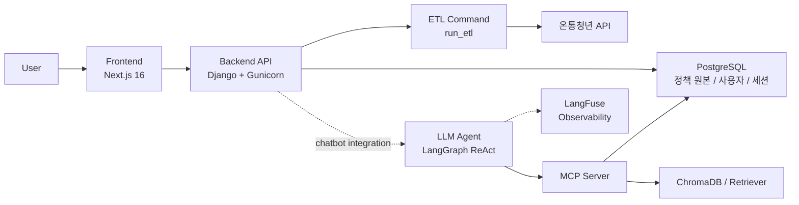
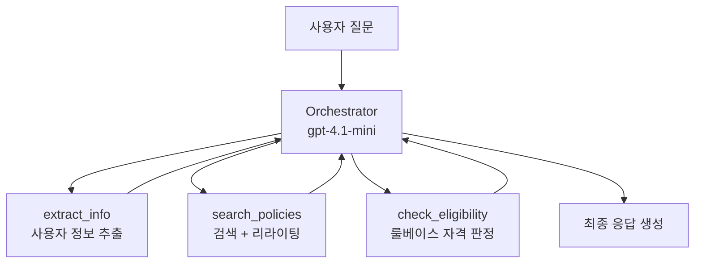
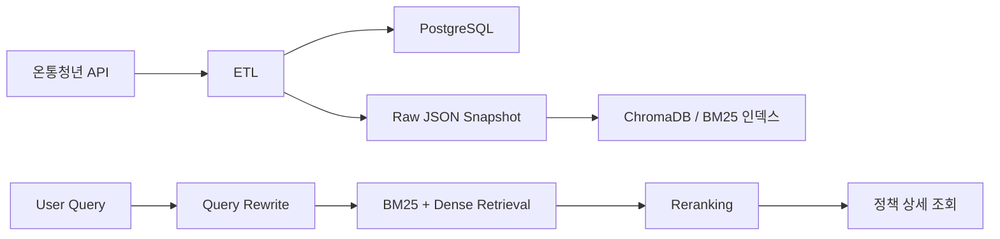

# 복지나침반 (Welfare Compass)

> 서울 청년을 위한 AI 복지정책 탐색 서비스


> **[Notion 프로젝트 문서](https://canyon-advantage-3a8.notion.site/Welfare-Compass-31b88193180e815ab542d78897bcdcc1?pvs=74)**

## 1. 프로젝트 소개

복지나침반은 서울 청년이 복지정책을 더 쉽게 찾고, 본인에게 맞는 정책인지 빠르게 확인할 수 있도록 돕는 서비스입니다.

사용자는 프로필 입력을 통해 정책 후보를 좁히거나, 자연어 질문 기반 탐색 파이프라인을 통해 정책을 찾을 수 있습니다. 서비스는 정책 원문 데이터, 하이브리드 검색, 자격 판정 로직을 결합해 맞춤형 후보를 제시하는 것을 목표로 합니다.

예를 들어 이런 질문을 다루고자 합니다.

- "27살인데 월세 지원 받을 수 있어요?"
- "취준생인데 교통비 지원 같은 거 있나요?"
- "서울 사는 청년이 받을 수 있는 문화 혜택 알려줘"

---

## 2. 문제 정의 + 해결 방안

### 문제 정의

청년 복지정책은 존재하지만, 실제 수혜로 이어지지 않는 구조적 문제가 있습니다.

| 문제 | 설명 |
| --- | --- |
| 낮은 정책 인지율 | 자격이 있어도 본인이 대상인지 모르고 지나치는 경우가 많음 |
| 자격 요건 해석의 어려움 | 연령, 소득, 취업 상태, 거주지 등 조건이 복잡하고 난해함 |
| 정보 분산 | 정책 정보가 여러 채널에 흩어져 있어 탐색 비용이 큼 |
| 검색 한계 | 키워드 기반 검색만으로는 사용자 맥락을 반영하기 어려움 |

### 해결 방안

복지나침반은 두 가지 진입 방식을 함께 제공합니다.

| 구분 | Stage 1: 폼 기반 매칭 | Stage 2: 자연어 탐색 |
| --- | --- | --- |
| 사용 방식 | 나이, 소득, 거주지, 관심 분야 입력 | 자유로운 일상어 질문 |
| 장점 | 빠르고 비용이 적음 | 사용자 맥락을 더 유연하게 반영 |
| 핵심 가치 | 1차 스크리닝 | 정밀 탐색과 후속 질문 기반 탐색 |

핵심 설계 원칙은 다음과 같습니다.

- 정책 원문은 PostgreSQL에 보관하고 검색 인덱스는 분리해 관리합니다.
- 검색은 BM25, Dense Retrieval, Reranker를 조합한 하이브리드 구조를 사용합니다.
- 자격 판정은 LLM이 아니라 룰베이스로 분리해 안정성과 설명 가능성을 높입니다.

---

## 3. 주요 기능

| 기능 | 설명 |
|------|------|
| 프로필 기반 정책 매칭 | 나이·소득·거주지 등 조건으로 정책 후보 필터링 |
| 자연어 정책 탐색 | 일상어 질문 → 하이브리드 검색 + 에이전트 파이프라인 |
| 정책 상세·스크랩 | 상세 조건 확인, 관심 정책 스크랩, 캘린더·지도 탐색 |
| 관리자 운영 | ETL 데이터 수집·적재, 포스터 이미지 관리 |

<details>
<summary><b>프로필 기반 정책 매칭</b></summary>

- 나이, 지역, 소득, 취업 상태, 학력 등 조건을 바탕으로 정책 후보를 필터링합니다.
- 사용자가 긴 공고문을 읽지 않아도 본인 조건에 가까운 정책을 빠르게 좁힐 수 있습니다.
- 자격 판정은 LLM이 아니라 룰베이스로 분리해 안정성과 설명 가능성을 확보했습니다.

</details>

<details>
<summary><b>자연어 기반 정책 탐색 파이프라인</b></summary>

- 자연어 질문을 검색 친화적인 쿼리로 재작성한 뒤 정책 후보를 찾도록 설계했습니다.
- BM25, Dense Retrieval, Reranker를 조합한 하이브리드 검색 구조를 사용합니다.
- 검색, 리라이팅, 자격 판정 도구를 분리해 에이전트 파이프라인을 확장 가능하게 구성했습니다.

</details>

<details>
<summary><b>정책 상세, 스크랩, 마이페이지</b></summary>

- 정책 상세 정보와 자격 조건을 확인할 수 있습니다.
- 관심 정책을 스크랩하고 마이페이지에서 다시 모아볼 수 있습니다.
- 캘린더, 지도, 필터 UI를 통해 정책 탐색 경험을 확장했습니다.

</details>

<details>
<summary><b>관리자 중심 운영 기능</b></summary>

- ETL을 통해 정책 데이터를 수집, 변환, 적재합니다.
- 관리자는 정책 정보를 관리하고, 정책별 포스터 이미지를 업로드할 수 있습니다.

</details>

---

## 4. 스크린샷 / 데모

> 아래는 자리만 잡아둔 초안입니다. 실제 스크린샷과 데모 링크로 교체하면 됩니다.

- 메인 화면: `[스크린샷 추가 예정]`
- 정책 검색 / 리스트 화면: `[스크린샷 추가 예정]`
- 챗봇 화면: `[스크린샷 추가 예정]`
- 캘린더 / 지도 화면: `[스크린샷 추가 예정]`
- 마이페이지 화면: `[스크린샷 추가 예정]`
- 시연 영상 또는 배포 링크: `[추가 예정]`

---

## 5. 시스템 아키텍처 + 에이전트 파이프라인 + 데이터 흐름

> 아래 다이어그램은 현재 저장소 기준 구조를 중심으로 정리한 것입니다.

### 시스템 아키텍처



### 에이전트 파이프라인



### 데이터 흐름



---

## 6. 기술 스택 + 선택 근거

| 영역 | 기술 | 선택 이유 |
| --- | --- | --- |
| Backend | Django 5, Django REST Framework, Gunicorn | 정책, 회원, 세션, 관리자 기능이 필요한 서비스 구조에 적합하고 API 개발 속도가 빠름 |
| Frontend | Next.js 16, React 19, TypeScript, Tailwind CSS, pnpm | App Router 기반 UI 구성과 클라이언트 기능 확장에 유리함 |
| Agent | LangGraph (ReAct) | 질문 맥락에 따라 필요한 도구를 유연하게 선택할 수 있음 |
| LLM | GPT-4o-mini | 비용 대비 응답 품질과 속도의 균형이 좋음 |
| Retrieval | BM25 + Dense Retrieval + BGE Reranker | 키워드 매칭과 의미 검색을 함께 활용해 검색 정확도를 높임 |
| Vector Store | ChromaDB | 로컬 개발과 프로토타이핑에 적합한 경량 벡터 저장소 |
| Database | PostgreSQL 15 | 정책 원문과 서비스 데이터를 안정적으로 저장하는 Ground Truth 역할 |
| MCP | Model Context Protocol | Agent와 검색 파이프라인을 느슨하게 분리해 확장성과 역할 분담을 확보 |
| Tokenizer / Search | Kiwi, FlagEmbedding 계열 | 한국어 검색 품질 개선과 리랭킹 고도화에 활용 |
| Observability | LangFuse | 프롬프트, 비용, 응답 흐름 추적. 환경변수 미설정 시 graceful degradation |

---

## 7. 성과 지표

| 지표 | 수치 |
| --- | --- |
| 정책 데이터셋 규모 | 409개 정책 (온통청년 API 기준) |
| 검색 latency | 1.3초 (싱글톤 캐싱 + 워밍업 적용 후, 적용 전 10.9초) |
| 챗봇 응답 지연 | 첫 요청 ~36초, 이후 ~26초 (에이전트 오케스트레이션 포함) |
| ToolMessage 최적화 | context -60%, latency -74% (경량화 적용 후) |
| 자격 판정 | 룰베이스 기반, LLM 의존 없음 |
| 폼 기반 매칭 비용 | LLM 호출 없이 동작 |

---

## 8. 로컬 세팅 가이드

### 8-1. 사전 요구사항

- Python 3.10+
- Node.js 20+ 권장
- Docker / Docker Compose
- PostgreSQL 15
- OpenAI API Key
- 온통청년 API Key
- `uv` (선택, MCP/LLM 모듈을 로컬 실행할 때 권장)

### 8-2. 빠른 시작: Docker로 DB + Backend 실행

가장 안전한 시작 방법은 DB와 Backend를 먼저 Docker로 올리고, Frontend는 로컬에서 실행하는 방식입니다.

```bash
git clone [저장소 URL]
cd 4brain-welfare

cp .env.docker.example .env.docker
```

`.env.docker`에는 최소한 아래 값을 채워주세요.

- `YOUTH_API_KEY`
- `OPENAI_API_KEY`

Backend와 DB 실행:

```bash
docker compose up --build db backend
```

> **GPU 사용 시 (NVIDIA)**:
> ```bash
> export COMPOSE_FILE="docker-compose.yaml:docker-compose.gpu.yml"
> docker compose up --build
> ```

> **기존 볼륨이 남아 있는 경우** (DB 유저 mismatch 등):
> `docker compose down -v` 로 볼륨 초기화 후 다시 `up -d`

접속 주소:

- Backend API: `http://localhost:8000`
- DB: `localhost:5432`

> `frontend` 서비스는 compose에 정의되어 있지만 현재 저장소에는 `frontend/Dockerfile`이 없습니다.
> 따라서 Frontend는 아래의 로컬 실행 방식을 기준으로 안내합니다.

> `mcp` 서비스는 compose에 정의되어 있지만 GPU reservation 설정이 포함되어 있습니다.
> 비-NVIDIA 환경에서는 별도 조정이 필요할 수 있으므로, 기본 가이드는 Backend 우선 실행 기준으로 정리합니다.

### 8-3. Frontend 로컬 실행

```bash
cd frontend
pnpm install
pnpm dev
```

기본 접속 주소:

- Frontend: `http://localhost:3000`
- Backend API: `http://localhost:8000`

프론트엔드는 `NEXT_PUBLIC_API_BASE_URL`이 없으면 기본값으로 `http://localhost:8000`을 사용합니다.
Google 로그인이나 Kakao Map 기능까지 함께 쓰려면 `frontend/.env.local`에 아래 환경변수를 설정하세요.

- `NEXT_PUBLIC_GOOGLE_CLIENT_ID`
- `NEXT_PUBLIC_KAKAO_MAP_API_KEY`
- `NEXT_PUBLIC_API_BASE_URL` (필요 시)

### 8-4. Backend 로컬 실행

로컬 Postgres를 직접 쓰거나, DB만 Docker로 띄운 뒤 Backend를 로컬에서 실행해도 됩니다.
DB만 Docker로 띄우려면:

```bash
docker compose up -d db
```

루트에서 환경변수 파일을 준비합니다.

```bash
cp backend/.env.example .env
```

`.env`에서 최소한 아래 항목을 확인하거나 추가하세요.

- `DB_NAME`
- `DB_USER`
- `DB_PASSWORD`
- `DB_HOST`
- `DB_PORT`
- `DJANGO_DEBUG=True`
- `DJANGO_SECRET_KEY=django-insecure-local-dev`
- `YOUTH_API_KEY`
- `OPENAI_API_KEY`

그다음 Backend를 실행합니다.

```bash
pip install uv
uv sync
source .venv/bin/activate

cd backend
python manage.py migrate
python manage.py run_etl
python manage.py runserver
```

### 8-5. MCP / LLM 로컬 실행

LLM 검색 파이프라인과 MCP 서버를 별도로 검증하려면 루트에서 실행합니다.

```bash
pip install uv
uv sync
uv run python -m llm.mcp.server
```

로컬 MCP를 사용할 경우 루트 `.env`에 아래 값을 맞추는 편이 안전합니다.

```env
SEARCH_BACKEND=mcp
MCP_HOST=127.0.0.1
MCP_BIND_HOST=0.0.0.0
MCP_PORT=8001
```

---

## 9. 테스트

### Backend / ETL 테스트

```bash
source .venv/bin/activate
cd backend
python manage.py test policies etl
```

### LLM 오케스트레이터 계약 검증

```bash
source .venv/bin/activate
pytest llm/agents/tests/test_orchestrator_integration.py -v -m integration_orchestrator
```

### 라이브 통합 스모크 테스트

```bash
source .venv/bin/activate
pytest llm/agents/tests/test_orchestrator_integration.py -v -m integration_live
```

### Frontend 품질 체크

```bash
cd frontend
pnpm lint
npx tsc --noEmit
```

| 트랙 | 목적 |
| --- | --- |
| Django Test Runner | 백엔드 앱 및 ETL 검증 |
| integration_orchestrator | 실제 LLM + stub 도구 기준 계약 검증 |
| integration_live | 실제 LLM + 실제 도구 기준 연결 스모크 |
| Frontend Lint / Type Check | UI 레이어 기본 품질 검증 |

> `integration_live`는 API 키, 외부 연결 상태, 인덱스 준비 상태에 따라 실행 환경 영향을 받을 수 있습니다.

---

## 10. 팀 구성

| 이름 | 역할 | 담당 |
| --- | --- | --- |
| 권은영 | Project Lead / Fullstack | 프로젝트 리드, Next.js UI/UX, Django API |
| 심유나 | LLM / Agent | LangGraph Agent, 프롬프트, 검색 파이프라인, 에이전트 파이프라인 |
| 안준용 | Backend / Infra | Django API, DB, ETL, Docker 인프라 |

---

## 11. 트러블슈팅

<details>
<summary><b>rewrite_query를 독립 도구로 둘 때 검색 품질이 흔들리던 문제</b></summary>

초기에는 `rewrite_query`를 오케스트레이터가 선택적으로 호출하는 구조로 두었습니다.  
그런데 사용자의 표현이 짧거나 애매할 때도 오케스트레이터가 리라이팅을 건너뛰는 경우가 있어 검색 품질이 흔들렸습니다.

그래서 현재는 검색 도구 내부에서 쿼리 리라이팅이 자연스럽게 포함되도록 구조를 정리해, 검색 여부는 오케스트레이터가 판단하되 검색 전처리는 더 안정적으로 수행되도록 맞췄습니다.

</details>

<details>
<summary><b>자격 판정을 LLM에 맡기면 설명 가능성과 안정성이 떨어지는 문제</b></summary>

정책 자격 조건은 문장 표현이 제각각이고, 소득, 연령, 학력, 취업 상태처럼 정확한 판정이 필요한 요소가 많습니다.  
이 영역을 LLM에 전적으로 맡기면 응답은 자연스럽더라도 판정 근거가 흐려질 수 있습니다.

그래서 자격 판정은 룰베이스로 분리하고, LLM은 정보 추출과 질의 이해, 응답 생성에 집중하도록 역할을 분리했습니다.

</details>

<details>
<summary><b>로컬 실행 시 서비스 구성이 한 번에 맞지 않던 문제</b></summary>

백엔드, MCP, 프론트, DB가 각각 다른 의존성과 실행 조건을 갖고 있어 로컬 환경에서 초기 세팅이 자주 어긋났습니다.

이를 줄이기 위해 `docker-compose.yaml`, `.env.docker.example`, `backend/.env.example`를 기준으로 실행 경로를 분리하고, Frontend는 현재 로컬 실행을 기준으로 안내했습니다.

</details>

---

## 12. ADR

<details>
<summary><b>왜 ReAct Agent를 선택했는가?</b></summary>

복지정책 탐색은 단순 검색보다 "정보가 부족한지", "검색이 필요한지", "자격 판단을 해야 하는지"를 상황별로 나눠 판단해야 합니다.  
고정 파이프라인보다 ReAct 구조가 이런 분기와 후속 질문에 더 유연하게 대응할 수 있다고 판단했습니다.

</details>

<details>
<summary><b>왜 PostgreSQL과 검색 인덱스를 분리했는가?</b></summary>

정책 원문 데이터는 정합성과 조회 안정성이 가장 중요하므로 PostgreSQL을 Ground Truth로 두고, 검색 성능을 위한 인덱스 계층은 별도로 두는 구조가 적합했습니다.  
이렇게 하면 검색 계층을 바꾸더라도 원본 데이터 관리 방식은 흔들리지 않습니다.

</details>

<details>
<summary><b>왜 MCP로 검색 파이프라인을 분리했는가?</b></summary>

Agent와 검색 파이프라인을 한 코드베이스 안에 강하게 결합하면, 검색 전략을 바꿀 때 Agent 코드까지 함께 흔들리게 됩니다.  
MCP로 경계를 분리하면 검색 계층을 독립적으로 개선할 수 있고, 팀 단위 병렬 개발도 쉬워집니다.

</details>

---

## 13. 향후 계획

- 멀티턴 대화 컨텍스트 누적 개선 (이전 턴 사용자 정보 재활용)
- 에이전트 오케스트레이션 최적화 (검색형 질문 fast-path)
- 스트리밍 응답 (SSE)
- Celery 기반 비동기 작업 큐
- GCP 배포
